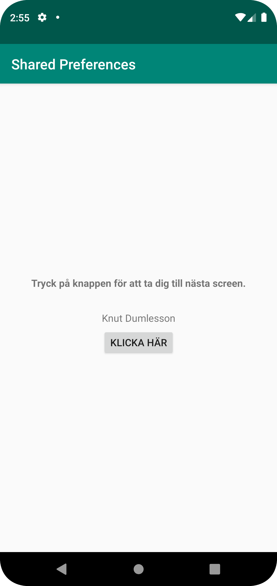

# Rapport

I uppgiften skapades först en SharedPreference variabel vid namn "preferences" i main_activity som används för att hämta och skriva ut data.
Detta görs först efter att data lagts till i SharedPreferences, vilket användaren får göra i en annan aktivitet.
Därför skapades en andra aktivitet som användaren kan navigera sig till med hjälp av en knapp med en onClickListener och ett Intent.
```
button.setOnClickListener(new View.OnClickListener() {
    @Override
    public void onClick(View view) {
        Intent intent = new Intent(MainActivity.this, SecondActivity.class);
        startActivity(intent);
        SharedPreferences.Editor editor = preferences.edit();
        editor.clear().apply();
    }
});
```

Denna knapp städar också upp alla data i SharedPreferences, vilket betyder att om det redan finns utskriven data på första screenen raderas den när användaren navigerar till andra screenen.

I andra aktivitetens onCreate kopplas först variabelnamn samman med IDs på inputfält och knapp. När användaren trycker på knappen körs en onCreate som startar en SharedPreferences.Editor.
Med hjälp av editorn läggs en sträng till i SharedPreferences med nyckelnamnet "name" och värdet i inputfältet, vilket är en textsträng. Slutligen appliceras ändringarna i SharedPreferences och användaren skickas tillbakas till första aktiviteten.

```
button.setOnClickListener(new View.OnClickListener() {
    @Override
    public void onClick(View view) {
        Intent intent = new Intent(SecondActivity.this, MainActivity.class);
        SharedPreferences.Editor editor = preferences.edit();
        editor.putString("name", input.getText().toString());
        editor.apply();
        startActivity(intent);

    }
});
```

Väl tillbaka på första aktiviteten körs nu en onResume funktion som hämtar och skriver ut värdet på nyckelnamnet "name" i SharedPreferences i en textView.
```
protected void onResume() {
    super.onResume();
    preferences = getSharedPreferences("preferences", MODE_PRIVATE);
    Log.d("==>", "Main Activity resumed!");
    String name = preferences.getString("name", "");
    Log.d("==>", name);
    textViewName.setText(name);
}
```

Nedan visas en screenshot på hur det ser ut när appen har skrivit ut "name" från SharedPreferences.

